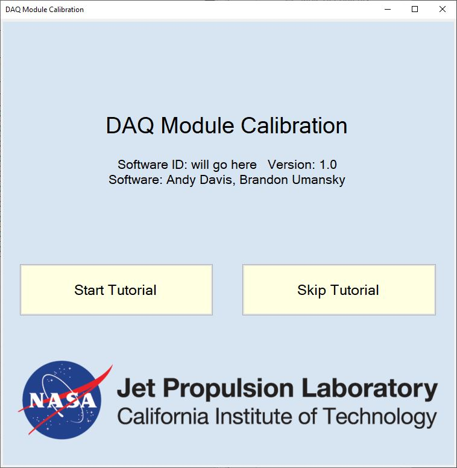
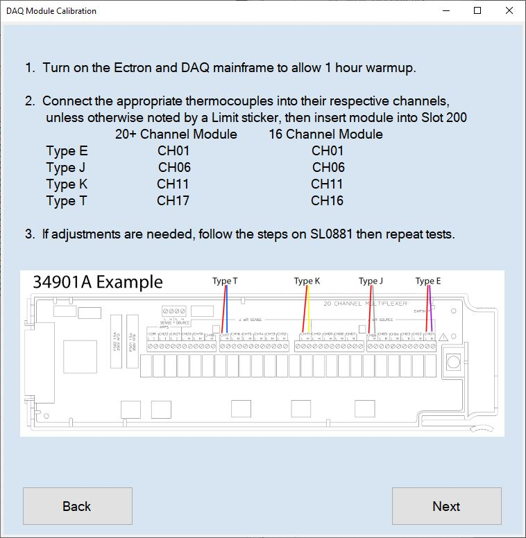
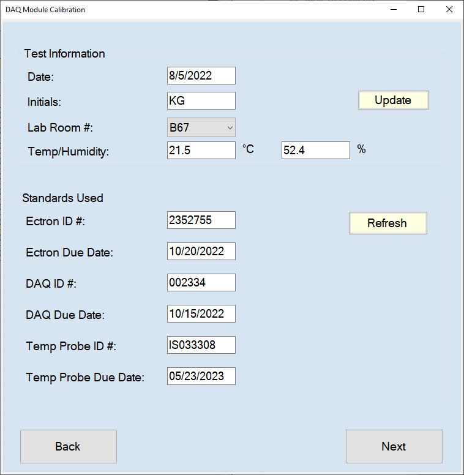
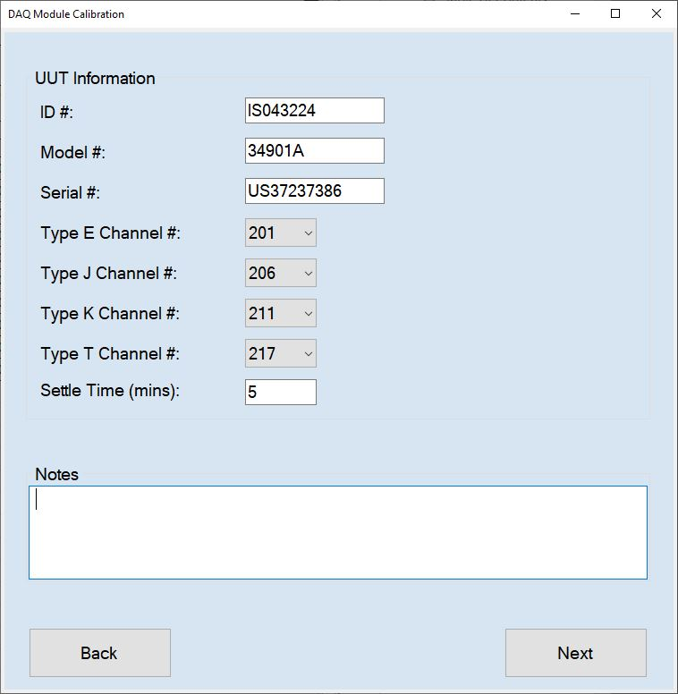
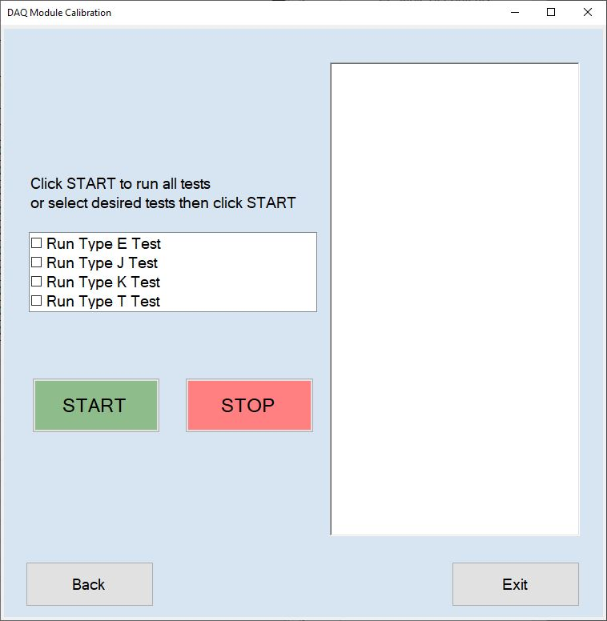
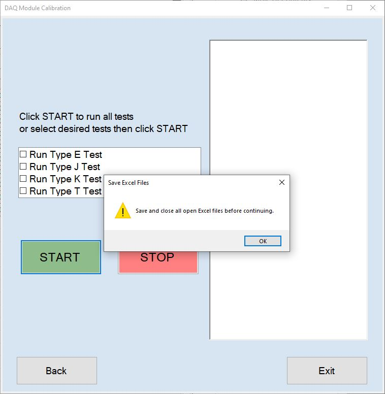
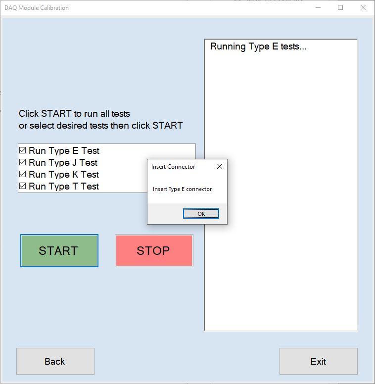
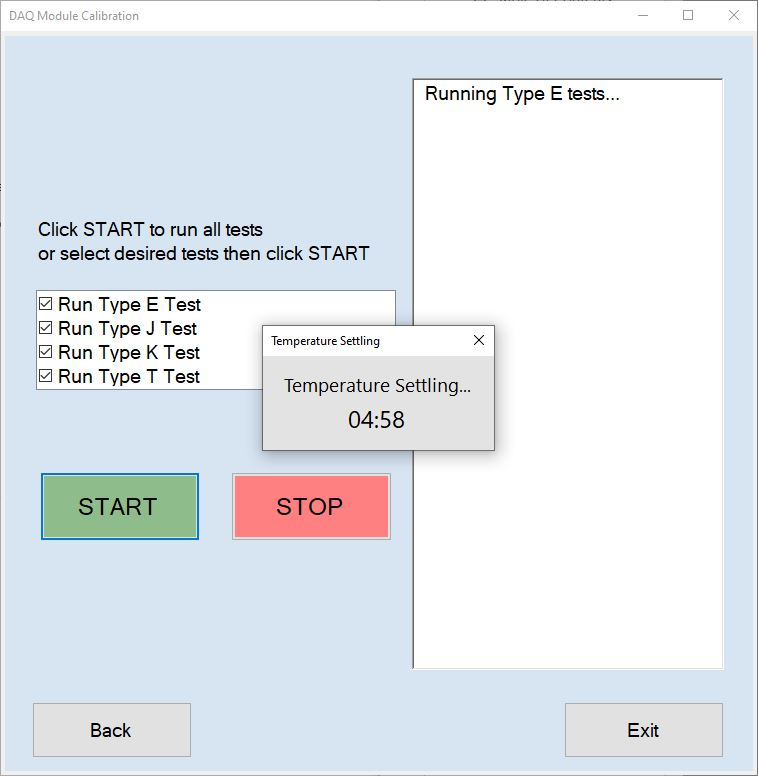
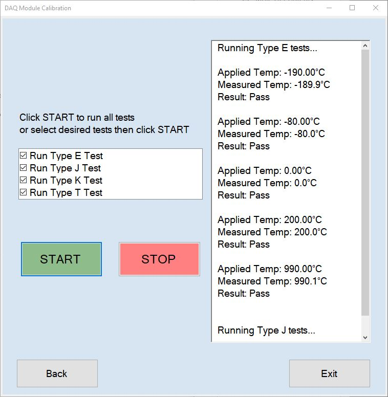

# Calibration of Keysight 34970A/34980A/DAQ970A Modules
### \*\* Updated in Metrology Suite \*\*

Language Used:  C#  
IDE Used:  Visual Studio  
Published Using:  One Click within Visual Studio   

The Keysight Data Acquisition Unit has a multitude of modules that can be plugged into the back, but only a few have a reference junction (aka they can measure temperature).   
This program was designed to calibrate those with the reference junction: 34901A, 34902A, 34908A, 34921A/T, DAQM900A, DAQM901A, DAQM902A.   

## Presentation

Upon loading the program you are greeted with the main page showing the Title, Software ID (which is not assigned since I never officially published this program to the group), Version, Developers, and the two options to start the program.   

  

If the user does not have experience calibrating these units, then it would be advised to go to the Tutorial, otherwise it could be skipped.  
The Tutorial gave steps on how long to warm up the instruments, which channels to use, and which slot to connect the module in to.  
Everything is referenced in our Procedure number SL0881.   

  

Once the user is past the Tutorial (or if it were skipped), they would come across the setup page in which the information should already be filled in except for their initials and the correct lab location if it is their first time using the program.  Subsequent uses will fill in the initials and correct lab automatically.  
This page connects with both the database as well as Environmental Monitoring System to grab the relevant data.   

  

Next, it is time to enter the Unit Under Test's (UUT) information.  All that is needed is the ID Number.  Once the user tabs out or clicks on to another box, the Model number, Serial number, and Notes get filled automatically from the database.  
The channel numbers will also change based on the Model Number (defaulted to what the Tutorial references).  
The default time to let the temperature settle is 5 minutes, but can be changed.  
Notes are from previous Limitations on the UUT or for any future ones.   

  

Finally, we get to the Tests page.  The user has the choice to run indiviual tests, or if none are selected the program will run all four.   

  

When starting the tests, the program asks you to close all open Excel files first.  
This is due to C# and needing to kill all Excel processes in order to take control of the resource, as well as making sure to relinquish control at the end by killing processes again.  
The program will then ask for a location to save the Excel file before starting the first test.   

  

Each test will remind you to connect the correct Thermocouple type to the Calibrator.   

  

At this point, the program takes over by first changing the Calibrator and UUT to the correct settings and then operating (or turning off standby) the Calibrator.  
Next, we wait for the temperature to settle with a given countdown. Then, the program will go through the different set points and taking measurement readings from the UUT.   

  

  

With that, the user has the choice to start over to run another UUT, or can quit the program at this time.

