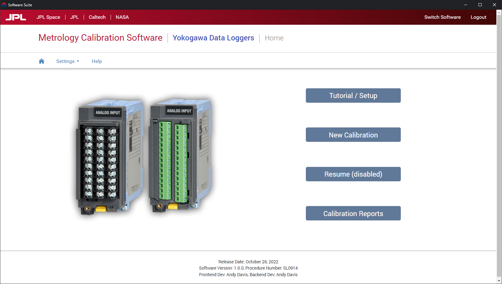

# Calibration Suite with Multiple Sub Programs

Language Used:  Python, HTML, CSS, JavaScript/JQuery  
IDE Used:  PyCharm  
Published Using:  PyInstaller   

\*\* All sub programs have the same basic layout, so the images will be from those that are more complete \*\*

## Keysight Data Acquisition Unit - Temperature Modules

The Keysight Data Acquisition Unit has a multitude of modules that can be plugged into the back, but only a few have a reference junction (aka they can measure temperature).   
This program was designed to calibrate those with the reference junction: 34901A, 34902A, 34908A, 34921A/T, DAQM900A, DAQM901A, DAQM902A.   

# Program Images

Upon starting the program, you will be greeted with a custom Splash Screen that runs a few functions in the background while loading the main program, such as checking for updates and searching for connected instruments    

  

Once the main program has finally loaded, the user will choose which sub program they want to run as well as needing to login with their IndySoft (JPL Metrology's asset tracking software) account.   

  

After logging in and choosing the sub program, the meat of the programs will present itself with the respective index pages.   

  

A quick detour up to the menu bar, let's see what is under the "Settings" menu  

  

The preferences page will be the same across the entire app, which holds general information such as user initials (for datasheets), lab room number (to get temperature/humidity data), and the preferred window size for the app.  Connected standards are a work in progress, so it may not be around.   

  

UUT (or Unit Under Test) and STD (or Standard) Specifications pages will change depending on the sub program that is running.   

  

  

At the end of it all, if you decided to run a different sub program without closing the entire app, you have the choice to do so without needing to log in again.   

  
